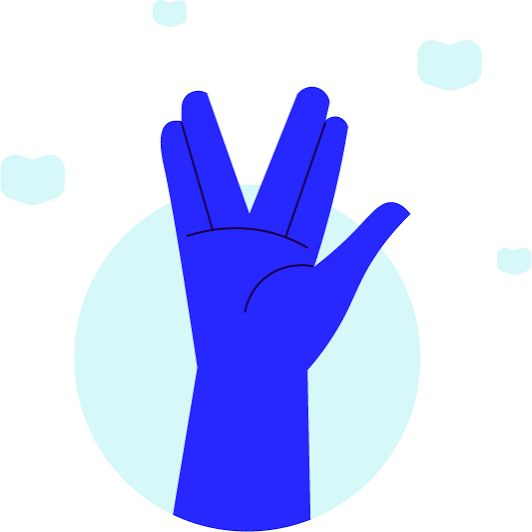

<h1 align="center">
  Git e Github – Curso em Vídeo

 
</h1>

  Repositório de estudos baseado no curso de Git & GitHub do 
  <strong>Curso em Vídeo</strong>, ministrado pelo Prof. <strong>Gustavo Guanabara 👨🏻‍🏫 <strong>

<h2 align="center">👨🏻‍💻 Autor deste Repositório: </h2>

Lucas Paguetti Pereira 🧙‍♂️  
🏫 Instuição: Cesar School 🎓🧡  
📍 Recife, Pernambuco — <strong>Brazil</strong> 🇧🇷  

 

<h2 align="center">🌐 Curso em Vídeo</h2>

<h2 align="center">
  🏆 Certificado de Git e GitHub
  
  
</h2>

  

  ✅ Certificado obtido através do curso <strong>Git e GitHub</strong> do  
  <strong>Curso em Vídeo,   
  tendo 70% ou mais de aproveitamento.</strong>

 

  
  
  

